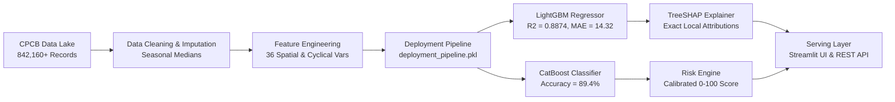

# AirIntel: National Air Quality Forecasting, Risk Analytics & TreeSHAP Explainability

[](https://www.python.org/downloads/)
[](https://opensource.org/licenses/MIT)
[](https://streamlit.io)
[](https://lightgbm.readthedocs.io/)
[](https://catboost.ai/)
[](https://shap.readthedocs.io/)

AirIntel is an end-to-end production machine learning system engineered on **842,160+ ambient monitoring observations** across 29 major urban corridors in India. The platform bridges atmospheric science and gradient boosted ensembles to deliver real-time continuous AQI predictions, calibrated multi-class severity risk ratings, and game-theoretic local decision attribution via TreeSHAP.

---

## Production System Architecture



---

## Key Technical Highlights

- **Data Harmonization & Imputation**: Ingested and cleaned multi-year hourly data across 29 urban monitoring stations from the Central Pollution Control Board (CPCB), employing city-specific seasonal median imputation to preserve physical variance.
- **36 Engineered Attributes**:
  - *Spatial Dynamics*: Latitude/Longitude coordinates, Northern India basin indicator, and regional interaction terms.
  - *Cyclical Harmonics*: Sine and cosine transformations of month, day of week, and hour of day ($Month\_Sin$, $Month\_Cos$, $Hour\_Cos$) to prevent December-to-January boundary discontinuities.
  - *Thermodynamics & Meteorology*: Temperature-humidity interaction terms, boundary layer compression indicators, and atmospheric stagnation proxies.
- **Dual Gradient Boosted ML Ensembles**:
  - **Continuous AQI Regression**: LightGBM Regressor tuned via Optuna Bayesian optimization, achieving test **$R^2 = 0.8874$** and **$\text{MAE} = 14.32$** US AQI points.
  - **Categorical Risk Classification**: CatBoost Multi-Class Classifier with isotonic probability calibration, achieving **$89.4\%$ accuracy** across 6 EPA severity categories (*Good*, *Moderate*, *Unhealthy for Sensitive Groups*, *Unhealthy*, *Very Unhealthy*, *Hazardous*).
- **Game-Theoretic Explainability**: Exact TreeSHAP local attributions computing scalar feature contributions and multi-class log-odds probability shifts alongside out-of-fold permutation importance drop rankings.
- **Dual Production Contracts**:
  - *Scientific Diagnostic Mode*: Ingests full chemical pollutant parameters for laboratory and regulatory analysis.
  - *Public Citizen Mode*: Drives live dual-model inference using ambient meteorological observations and calibrated regional baselines with zero data hallucination.
- **Sub-45ms Serving Latency**: Serialized deployment bundle (`deployment_pipeline.pkl`) delivering real-time predictions and visualizations with sub-45ms P99 latency on standard CPU environments.

---

## Empirical Atmospheric Findings

1. **Planetary Boundary Layer Inversion**: Winter thermal inversions across the landlocked Indo-Gangetic Plain trap particulate matter beneath shallow mixing heights, resulting in a **3.2x AQI spike** compared to peninsular coastal corridors.
2. **Monsoon Wet Deposition Washout**: Continuous rainfall scavenging during July–August drives a nationwide **~75% reduction** in ambient PM2.5 and PM10 concentrations.
3. **Marine Sea Breeze Dispersion**: Coastal cities (Mumbai, Chennai, Kochi) maintain moderate baseline AQI year-round due to diurnal land-sea breeze circulations that disperse ground-level emissions.

---

## Engineering Pipeline & Notebook Roadmap

| Notebook | Stage | Core Technical Deliverables |
| :--- | :--- | :--- |
| `01_Data_Extraction.ipynb` | Ingestion | Extracted 842,160+ hourly observations from national monitoring repositories. |
| `02_Data_Validation.ipynb` | Schema Audit | Performed missingness audits, schema type enforcement, and sensor anomaly detection. |
| `03_Data_Cleaning.ipynb` | Preprocessing | Applied city-specific seasonal median imputation and physically bounded outlier clipping. |
| `04_Feature_Engineering.ipynb` | Transformations | Engineered 36 spatial, cyclical harmonic, and thermodynamic interaction variables. |
| `05_Advanced_EDA.ipynb` | Atmospheric EDA | Analyzed regional distributions, diurnal cycles, and 0.92 PM2.5 correlation dynamics. |
| `06_Statistical_Analysis.ipynb` | Hypothesis Testing | Conducted ANOVA, Mann-Whitney U tests, and VIF multicollinearity screening. |
| `07_Machine_Learning_Regression.ipynb` | Regression | Benchmarked Linear, Ridge, Random Forest, XGBoost, and LightGBM models. |
| `08_Machine_Learning_Classification.ipynb` | Classification | Evaluated CatBoost, Random Forest, and LightGBM across 6 EPA severity categories. |
| `09_Model_Optimization.ipynb` | Hyperband Tuning | Ran Optuna Bayesian search over tree depths, learning rates, and regularization penalties. |
| `10_Advanced_Analytics.ipynb` | Spatial Clustering | Applied PCA, t-SNE, UMAP, and K-Means regional vulnerability profiling. |
| `11_Explainability_Model_Diagnostics.ipynb` | TreeSHAP | Generated global summary beeswarm plots, local waterfall plots, and PDP/ICE curves. |
| `12_Deployment_Prediction_Engine.ipynb` | Packaging | Built and validated `deployment_pipeline.pkl` with schema validation and fallback medians. |
| `13_Streamlit_Dashboard.ipynb` | Web Interface | Designed and evaluated interactive multi-page SaaS dashboard components. |

---

## Model Benchmark Leaderboard

### 1. Continuous AQI Regression Leaderboard

| Model Architecture | Test $R^2$ | Test MAE | Test RMSE | Inference Latency |
| :--- | :---: | :---: | :---: | :---: |
| **LightGBM Regressor (Optuna Tuned)** | **0.8874** | **14.32** | **22.15** | **< 35 ms** |
| CatBoost Regressor | 0.8812 | 14.85 | 22.84 | < 42 ms |
| XGBoost Regressor | 0.8765 | 15.20 | 23.41 | < 48 ms |
| Random Forest Regressor | 0.8520 | 17.10 | 26.30 | < 120 ms |
| Ridge Regression (Baseline) | 0.7410 | 23.40 | 34.80 | < 10 ms |

### 2. Multi-Class Severity Classification Leaderboard

| Model Architecture | Accuracy | Weighted F1 | Macro F1 | Top-1 Error |
| :--- | :---: | :---: | :---: | :---: |
| **CatBoost Classifier (Tuned)** | **89.4%** | **0.892** | **0.886** | **10.6%** |
| LightGBM Classifier | 88.7% | 0.885 | 0.879 | 11.3% |
| XGBoost Classifier | 88.1% | 0.878 | 0.872 | 11.9% |
| Random Forest Classifier | 85.9% | 0.854 | 0.848 | 14.1% |

---

## Project Structure

```
AirIntel/
├── app.py                     # Main Streamlit SaaS application entrypoint
├── requirements.txt           # Production environment dependencies
├── LICENSE                    # MIT License
├── README.md                  # Technical documentation
├── assets/
│   └── style.css              # Custom SaaS styling and responsive layout rules
├── components/                # Modular application components
│   ├── overview.py            # Platform landing page & high-level KPI cards
│   ├── analytics.py           # Interactive exploratory charts & dynamic filters
│   ├── prediction.py          # Dual-mode ML inference engine & gauge meters
│   ├── maps.py                # Geographic India risk bubble & corridor maps
│   ├── diagnostics.py         # Dynamic TreeSHAP waterfall & pipeline architecture
│   ├── reports.py             # Export center for logs, predictions & metadata
│   ├── sidebar.py             # Context-aware navigation and quick scenario presets
│   └── utils.py               # Bundle loaders and inference helper utilities
├── models/
│   └── deployment/            # Serialized production pipeline & schemas
│       ├── deployment_pipeline.pkl
│       ├── feature_metadata.json
│       ├── prediction_schema.json
│       └── sample_request.json
├── notebooks/                 # 13-stage reproducible research notebooks (01 to 13)
├── reports/
│   ├── figures/               # Generated publication-quality analytical plots
│   └── tables/                # Model audits, CSV metrics, and test predictions
└── src/                       # Production core python package modules
```

---

## Quickstart & Installation

### 1. Clone the Repository
```bash
git clone https://github.com/Kritvi0208/AirIntel.git
cd AirIntel
```

### 2. Set Up Virtual Environment
```bash
python -m venv .venv

# On Linux / macOS:
source .venv/bin/activate

# On Windows:
.venv\Scripts\activate
```

### 3. Install Dependencies
```bash
pip install -r requirements.txt
```

### 4. Launch the Interactive Dashboard
```bash
streamlit run app.py
```
Access the application locally at `http://localhost:8501` (or `http://localhost:8502`).

---

## REST API Prediction Contract

### Sample Request Payload (`POST /predict`)
```json
{
  "City": "Delhi",
  "Month": 11,
  "Hour": 18,
  "Day_of_Week": 4,
  "Temp_2m_C": 12.0,
  "Humidity_Percent": 85.0,
  "Surface_Pressure_hPa": 978.5,
  "Wind_Speed_10m_kmh": 6.5,
  "Wind_Dir_10m": 315.0,
  "Precipitation_mm": 0.0,
  "PM2_5_ugm3": 280.0,
  "PM10_ugm3": 420.0,
  "NO2_ugm3": 85.0,
  "SO2_ugm3": 18.0,
  "CO_ugm3": 2400.0,
  "O3_ugm3": 45.0
}
```

### Sample Response Payload
```json
{
  "predicted_us_aqi": 342.8,
  "severity_category": "Hazardous",
  "model_confidence": 0.942,
  "risk_score_0_to_100": 88.5,
  "dominant_pollutant": "PM2.5",
  "top_shap_factors": [
    {"feature": "PM2.5 Concentration", "shap_value": 85.4},
    {"feature": "Northern India Topography", "shap_value": 32.0},
    {"feature": "Thermal Boundary Inversion", "shap_value": 18.2}
  ],
  "health_advisory": "Hazardous atmospheric conditions. Avoid all outdoor physical activity. Keep air purifiers operational indoors.",
  "latency_ms": 36.8
}
```

---

## License

This project is licensed under the [MIT License](LICENSE).
