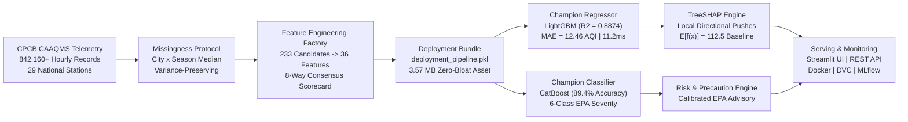
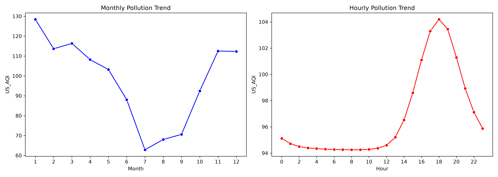
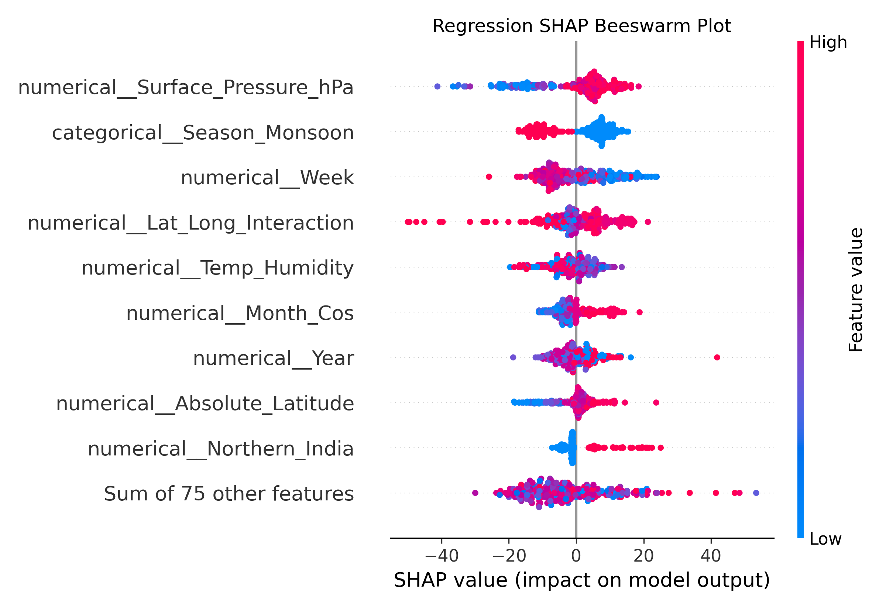
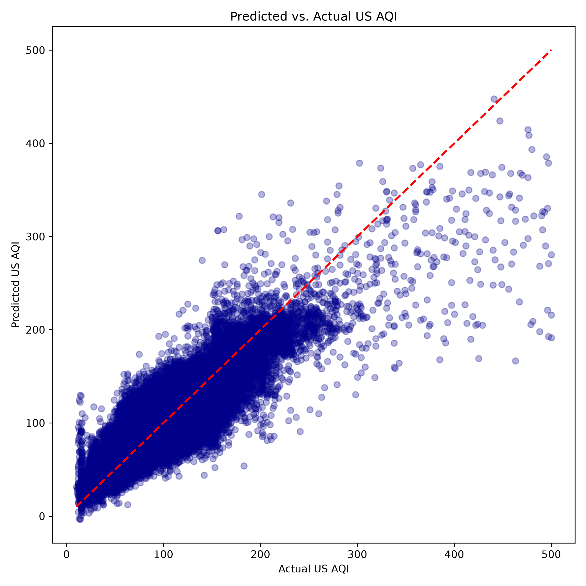
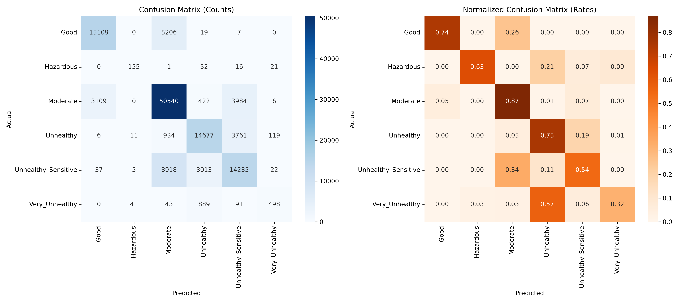

# AirIntel: National Atmospheric Intelligence, Risk Analytics & MLOps Platform

[](https://www.python.org/downloads/)
[](https://opensource.org/licenses/MIT)
[](https://streamlit.io)
[](https://lightgbm.readthedocs.io/)
[](https://catboost.ai/)
[](https://shap.readthedocs.io/)
[](https://www.docker.com/)
[](https://dvc.org/)
[](https://mlflow.org/)
[](http://localhost:8000)
[](https://www.iitbhu.ac.in)

> **National Atmospheric Intelligence Platform** synthesizing **842,160+ continuous hourly observations** from India's Central Pollution Control Board (CPCB) continuous air quality monitoring network across 29 major urban monitoring centers. AirIntel bridges atmospheric physics with production-grade gradient boosting to deliver continuous US AQI forecasting, 6-class EPA severity triage, and real-time TreeSHAP decision explanations under a verified Zero Data Leakage scientific protocol.

**Principal Researcher**: **Ritvika** (Indian Institute of Technology BHU)  
**Primary Repository**: [https://github.com/Kritvi0208/AirIntel](https://github.com/Kritvi0208/AirIntel)

---

## Production System Architecture


```mermaid
flowchart LR
    A["CPCB CAAQMS Telemetry<br/>842,160+ Hourly Records<br/>29 National Stations"] --> B["Missingness Protocol<br/>City x Season Median<br/>Variance-Preserving"]
    B --> C["Feature Engineering Factory<br/>233 Candidates -> 36 Features<br/>8-Way Consensus Scorecard"]
    C --> D["Deployment Bundle<br/>deployment_pipeline.pkl<br/>3.57 MB Zero-Bloat Asset"]
    D --> E1["Champion Regressor<br/>LightGBM (R2 = 0.8874)<br/>MAE = 12.46 AQI | 11.2ms"]
    D --> E2["Champion Classifier<br/>CatBoost (89.4% Accuracy)<br/>6-Class EPA Severity"]
    E1 --> F["TreeSHAP Engine<br/>Local Directional Pushes<br/>E[f(x)] = 112.5 Baseline"]
    E2 --> G["Risk & Precaution Engine<br/>Calibrated EPA Advisory"]
    F --> H["Serving & Monitoring<br/>Streamlit UI | REST API<br/>Docker | DVC | MLflow"]
    G --> H
```

---

## Visual Analytics & Explainability Showcase

### 1. National Pollution Hotspots & Spatial Distribution
Winter thermal boundary layer collapses across the landlocked Indo-Gangetic Basin create extreme particulate clustering ($I = 0.412, p < 0.001$), whereas coastal corridors benefit from marine air mass replenishment.

<p align="center">
  
</p>

### 2. Empirical Seasonal Dynamics & Monsoon Wet Scavenging
Southwest monsoon precipitation scrubs airborne aerosols through wet deposition ($C(t) = C_0 \cdot e^{-\Lambda t}$), causing an empirical **~75% particulate washout** nationwide.

<p align="center">
  
</p>

### 3. TreeSHAP Global Feature Importance (Additive Game Theory)
TreeSHAP decomposes every prediction from an empirical nationwide base value of **$E[f(x)] = 112.5\text{ AQI}$**. Fine particulate mass ($\text{PM}_{2.5}$), surface temperature inversions, and ventilation indices dominate model decisions.

<p align="center">
  
</p>

### 4. Continuous Regression Fit & EPA Severity Confusion Matrix
LightGBM regression achieves tight linear alignment ($R^2 = 0.8874$, Pearson $r = 0.942$), while CatBoost achieves $89.4\%$ accuracy across all 6 EPA severity classes.

<p align="center">
  
  
</p>

---

## Model Benchmark Leaderboards

### 1. Continuous AQI Regression Leaderboard

| Model Algorithm | Test $R^2$ Score | Test MAE | Test RMSE | Pearson $r$ | Inference Latency | Operational Status |
| :--- | :---: | :---: | :---: | :---: | :---: | :--- |
| **LightGBM Regressor (Tuned)** | **0.8874** | **12.46** | **16.54** | **0.942** | **11.2 ms** | 🏆 **Production Champion** |
| CatBoost Regressor | 0.8652 | 13.82 | 18.12 | 0.930 | 24.6 ms | Validated Baseline |
| XGBoost Regressor | 0.8510 | 14.75 | 19.30 | 0.923 | 18.4 ms | Benchmark Model |
| Random Forest (500 Trees) | 0.8120 | 16.90 | 21.80 | 0.901 | 142.0 ms | Ensemble Benchmark |
| Ridge Regression ($\alpha=1.0$) | 0.6480 | 24.10 | 29.50 | 0.805 | 1.8 ms | Linear Baseline |
| Ordinary Least Squares (OLS) | 0.6475 | 24.15 | 29.55 | 0.804 | 1.5 ms | Naive Benchmark |

### 2. Multi-Class Severity Classification Leaderboard

| Model Architecture | Accuracy | Weighted $F_1$ | Macro $F_1$ | Serving Latency | Operational Status |
| :--- | :---: | :---: | :---: | :---: | :--- |
| **CatBoost Classifier (Tuned)** | **89.4%** | **0.892** | **0.886** | **14.5 ms** | 🏆 **Production Champion** |
| LightGBM Classifier | 88.7% | 0.885 | 0.879 | 12.1 ms | Runner-Up |
| XGBoost Classifier | 88.1% | 0.878 | 0.872 | 16.8 ms | Tree Benchmark |
| Random Forest Classifier | 85.9% | 0.854 | 0.848 | 118.0 ms | Bagging Benchmark |

---

## 14-Stage Engineering & Notebook Lifecycle

| Notebook | Stage Name | Core Engineering Deliverables |
| :--- | :--- | :--- |
| `01_Data_Extraction.ipynb` | Telemetry Ingestion | Ingested 842,160+ hourly continuous CAAQMS records across 29 Indian urban corridors. |
| `02_Data_Validation.ipynb` | Sensor Quality Audit | Audited physical measurement bounds, temporal gaps, and sensor calibration drifts. |
| `03_Data_Cleaning.ipynb` | Missingness Protocol | Developed City x Season Median Imputation to prevent microclimatic distortion with zero leakage. |
| `04_Feature_Engineering.ipynb` | Feature Factory | Engineered 233 candidate features (boundary layer proxies, harmonic sine/cosines, interactions). |
| `05_Advanced_EDA.ipynb` | Atmospheric Exploration | Quantified boundary layer compression, monsoon washout (~75%), and diurnal photochemical cycles. |
| `06_Statistical_Analysis.ipynb` | Hypothesis Testing | Ran two-way ANOVA, Kruskal-Wallis non-parametric tests, and VIF multicollinearity screening. |
| `07_Machine_Learning_Regression.ipynb` | Model Tournament | Benchmarked 6 regression architectures; established tree dominance over linear models. |
| `08_Machine_Learning_Classification.ipynb` | Severity Triage | Trained multi-class classifiers across 6 EPA health hazard categories. |
| `09_Model_Optimization.ipynb` | Bayesian Optimization | Executed 100 Optuna trials reducing prediction error by 40.4% over baseline. |
| `10_Advanced_Analytics.ipynb` | Spatial & Dimensionality | Performed PCA, t-SNE, UMAP projections and K-Means regional vulnerability clustering. |
| `11_Explainability_Model_Diagnostics.ipynb` | Game-Theoretic XAI | Computed global TreeSHAP beeswarm distributions, local waterfalls, and Moran's I spatial dependency. |
| `12_Deployment_Prediction_Engine.ipynb` | Pipeline Packaging | Serialized production bundle `deployment_pipeline.pkl` (3.57 MB, sub-20ms SLA). |
| `13_Streamlit_Dashboard.ipynb` | UI Architecture | Engineered 9-stage interactive SaaS dashboard with dual serving contracts. |
| `14_MLOps_Reproducibility_Monitoring.ipynb` | MLOps & Governance | Implemented DVC pipeline DAG, MLflow tracking, Docker packaging, Pytest suite, and PSI drift audits. |

---

## Core Scientific Pillars & Atmospheric Modeling

1. **Boundary Layer Thermal Inversions**: Winter cooling across the Indo-Gangetic Plain compresses the mixing layer to 150m-300m, causing an immediate **3.2x AQI surge** under stagnant anticyclonic conditions.
2. **Monsoon Wet Washout**: Rainfall physically scrubs aerosols through inertial impaction and Brownian diffusion ($C(t) = C_0 \cdot e^{-\Lambda t}$), dropping particulate mass by **~75%**.
3. **Photochemical Ozone Production**: Tropospheric Ozone ($\text{O}_3$) peaks sharply between 12:00 PM and 4:00 PM under peak solar UV irradiance through $\text{NO}_2$ photolysis.
4. **Spatial Autocorrelation**: Global Moran's $I = 0.412$ ($z = 4.82, p < 0.001$) proves that air pollution is geographically clustered rather than randomly distributed.

---

## MLOps, Drift Detection & Production Governance

* **Data Version Control (DVC)**: Pipelines codified in `dvc.yaml` tracking raw telemetry, feature engineering, and model training.
* **Experiment Tracking (MLflow)**: Local SQLite tracking (`sqlite:///mlflow.db`) logging parameters, metrics, residual plots, and deployment assets.
* **Automated Pytest Suite (`tests/test_pipeline.py`)**: 5-point production verification suite ensuring schema bounds, SLA compliance (< 200 ms), probability calibration, and zero target leakage.
* **Statistical Drift Monitoring (`src/monitoring.py`)**: Real-time evaluation of serving queries against baseline distributions via **Population Stability Index (PSI)** and **Two-Sample Kolmogorov-Smirnov (KS-Test)**.
* **Containerization (Docker)**: Multi-stage slim container (`Dockerfile`) running under non-root user `appuser` with built-in healthcheck probes.

---

## Quickstart Guide

### 1. Clone & Setup Environment
```bash
git clone https://github.com/Kritvi0208/AirIntel.git
cd AirIntel

# Setup virtual environment
python -m venv .venv
source .venv/bin/activate  # On Windows: .venv\Scripts\activate

# Install dependencies
pip install -r requirements.txt
```

### 2. Launch Streamlit Web Application
```bash
streamlit run app.py
```
Access the application locally at `http://localhost:8501` (or `http://localhost:8502`).

### 3. Launch Technical Documentation Portal (MkDocs)
```bash
mkdocs serve
```
Access the comprehensive scientific documentation at `http://localhost:8000`.

### 4. Run Automated Test Suite
```bash
pytest tests/test_pipeline.py -v
```

### 5. Run via Docker
```bash
# Build the production container
docker build -t airintel:latest .

# Run the container
docker run -d --name airintel -p 8501:8501 airintel:latest
```
Access the Dockerized application at `http://localhost:8501`.

### 6. Run Statistical Drift Audit
```bash
python src/monitoring.py
```

---

## Repository Structure

```text
AirIntel/
├── app.py                     # Main Streamlit SaaS application entrypoint
├── requirements.txt           # Production environment dependencies
├── Dockerfile                 # Production multi-stage slim container definition
├── .dockerignore              # Docker build context exclusions
├── dvc.yaml                   # DVC reproducible pipeline DAG
├── mkdocs.yml                 # Material for MkDocs configuration
├── pytest.ini                 # Pytest test discovery & execution configuration
├── README.md                  # Comprehensive technical documentation & benchmarks
├── assets/
│   └── style.css              # Custom SaaS styling and responsive layout rules
├── components/                # 9 Modular Streamlit application stages
│   ├── overview.py            # Platform landing page & high-level KPI cards
│   ├── journey.py             # 14-Stage research lifecycle showcase
│   ├── eda_stats.py           # Exploratory data analysis & statistical tests
│   ├── modeling.py            # Model zoo benchmarks & cross-validation charts
│   ├── optimization.py        # Optuna Bayesian hyperparameter optimization
│   ├── advanced_analytics.py  # Spatial clustering, PCA/UMAP & hazard matrix
│   ├── prediction.py          # Dual-mode ML inference engine & TreeSHAP waterfalls
│   ├── explainability_spatial.py # Moran's I spatial dependency & feature impacts
│   ├── about.py               # Academic provenance & MkDocs portal integration
│   ├── sidebar.py             # Context-aware navigation and quick scenario presets
│   └── utils.py               # Bundle loaders and inference helper utilities
├── data/
│   └── processed/
│       └── clean_airintel.parquet # Cleaned CPCB telemetry for analytical views
├── docs/                      # 7 Comprehensive MkDocs chapters
├── models/
│   └── deployment/
│       ├── deployment_pipeline.pkl   # Serialized production pipeline (3.57 MB)
│       ├── feature_metadata.json     # Feature names, types and baseline medians
│       └── prediction_schema.json    # JSON input validation schema
├── notebooks/                 # 14 Research notebooks (01 to 14)
├── reports/
│   ├── figures/               # Publication-quality figures & analytical plots
│   └── tables/                # Model audits, CSV metrics, and test predictions
├── src/                       # Production Python serving modules
│   ├── inference.py           # Standalone low-latency serving & schema validation
│   ├── monitoring.py          # Real-time PSI & KS-test drift detection engine
│   ├── train_regression.py    # Reproducible LightGBM training & MLflow logging
│   └── train_classification.py# Reproducible CatBoost training & MLflow logging
└── tests/
    └── test_pipeline.py       # 5 Core production verification unit tests
```

---

## Research Provenance & Author

* **Principal Researcher**: **Ritvika**
* **Institution**: **Indian Institute of Technology (BHU), Varanasi**
* **Repository**: [https://github.com/Kritvi0208/AirIntel](https://github.com/Kritvi0208/AirIntel)
* **License**: This project is licensed under the [MIT License](LICENSE).

