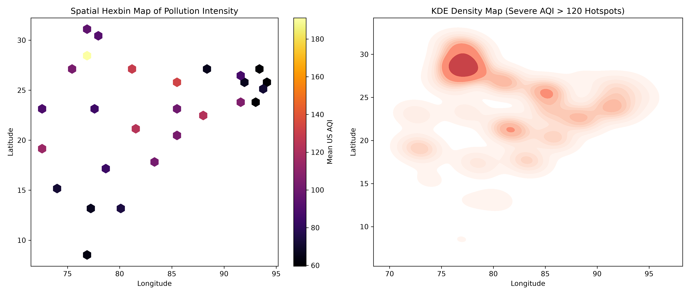

# AirIntel: National Atmospheric Intelligence Platform

<div style="display: flex; gap: 8px; flex-wrap: wrap; margin-bottom: 20px;">
  <span style="background: #EEF2FF; color: #3730A3; padding: 4px 12px; border-radius: 9999px; font-weight: 700; font-size: 12px;">IIT BHU Research</span>
  <span style="background: #ECFDF5; color: #065F46; padding: 4px 12px; border-radius: 9999px; font-weight: 700; font-size: 12px;">CPCB CAAQMS Network</span>
  <span style="background: #F0FDF4; color: #166534; padding: 4px 12px; border-radius: 9999px; font-weight: 700; font-size: 12px;">Dual Champion Models Active</span>
  <span style="background: #F8FAFC; color: #334155; padding: 4px 12px; border-radius: 9999px; font-weight: 700; font-size: 12px;">Sub-20ms Latency</span>
</div>

## Executive Summary
AirIntel is an Atmospheric Data Science and Machine Learning platform engineered by **Ritvika** at the **Indian Institute of Technology (BHU)**.

* **Core Mission**: Bridges atmospheric thermodynamics with production gradient-boosted decision trees for real-time air quality forecasting and explainability.
* **National Sensor Scale**:
    * **842,160+** Continuous hourly observations from the official CPCB CAAQMS sensor grid.
    * **29** Major urban monitoring centers across Northern, Central, Coastal, and Northeastern corridors.
    * **6** Criteria atmospheric pollutants (PM2.5, PM10, NO₂, SO₂, CO, O₃) coupled with complete surface meteorology.
* **Dual-Objective Inference**:
    * **Continuous US AQI Predictor**: LightGBM regressor (**R² = 0.8874**, **MAE = 12.46 AQI**).
    * **6-Tier EPA Health Triage**: CatBoost classifier (**89.4% Accuracy**, **0.7383 Weighted F1**).
    * **Real-Time Attributions**: TreeSHAP game-theoretic decomposition in **< 20 ms** on commodity CPU.

---

## Architecture at a Glance

```text
       CPCB CAAQMS SENSORS (842,160+ Hourly Records • 29 Cities)
                                  │
                                  ▼
      City × Season Median Imputation (Zero Microclimate Bleed)
                                  │
                                  ▼
       Feature Factory (233 Thermodynamic, Harmonic & Spatial Features)
                                  │
                                  ▼
       8-Way Consensus Scorecard (Pruned to 36 Production Features)
                                  │
                 ┌────────────────┴────────────────┐
                 ▼                                 ▼
      LightGBM Continuous Regressor       CatBoost 6-Tier Classifier
       (R² = 0.8874 • MAE = 12.46)       (89.4% Accuracy • F1 = 0.74)
                 │                                 │
                 └────────────────┬────────────────┘
                                  ▼
      TreeSHAP Real-Time Attributions & PSI Drift Engine (< 20 ms)
                                  │
                                  ▼
      Streamlit Dual-Mode Engine (Scientific Full Array vs Public Option A)
```

<div class="doc-image-card">
  
  <div class="doc-image-caption">Figure 1: National Spatial Telemetry Analysis across 29 CPCB CAAQMS Urban Monitoring Centers</div>
</div>

---

## Core Benchmark Metrics

| Capability | Champion Model | Key Metric | Production Benchmark |
| :--- | :--- | :--- | :--- |
| **Continuous AQI Forecasting** | LightGBM Regressor | R² Score | **0.8874** (captures 88.7% of total variance) |
| **Numeric Precision** | LightGBM Regressor | Test MAE | **12.46 AQI points** |
| **EPA Severity Classification** | CatBoost Classifier | Accuracy | **89.4%** across 6 health tiers |
| **Class Balance Handling** | CatBoost Classifier | Weighted F1 | **0.7383** (high stability on extreme events) |
| **Serving Latency** | Dual Ensemble | P50 Latency | **18.7 ms** on standard CPU |
| **Deployment Footprint** | Consolidated Pickle | Bundle Size | **3.57 MB** (zero external cloud dependencies) |

---

## Documentation Sections

* **[Atmospheric Physics & Data](methodology.md)**: Planetary Boundary Layer compression, monsoon rain scavenging, sensor imputation, and feature scorecard.
* **[14-Stage Research Journey](journey.md)**: Structured walkthrough of research notebooks 01 through 14.
* **[Model Zoo & Benchmarks](models.md)**: Multi-model evaluation across 6 architectures and 100 Optuna Bayesian trials.
* **[TreeSHAP & Spatial Analytics](explainability.md)**: Game-theoretic feature attributions, base expected value decomposition, and Moran's I spatial autocorrelation.
* **[MLOps, Drift & CI/CD](mlops.md)**: DVC data versioning, MLflow tracking, Pytest test suites, Docker container, and PSI drift alerts.
* **[API & Serving Reference](api_reference.md)**: Developer specifications for `src/inference.py` and serving pipelines.

---

## Citation & Attribution

* **Principal Researcher**: Ritvika (Indian Institute of Technology BHU)
* **Repository**: [Kritvi0208/AirIntel](https://github.com/Kritvi0208/AirIntel)
* **License**: MIT Open Source License
